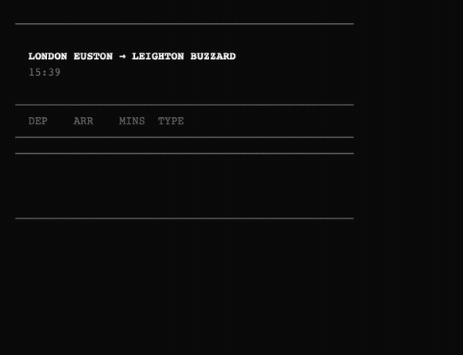

# Train Tracks — A Claude Code Skill for UK Train Times

A [Claude Code](https://docs.anthropic.com/en/docs/claude-code) skill that checks live UK train departures, warns about disruptions, and adds trains to your Apple Calendar. Built on the free [Huxley2](https://github.com/jpsingleton/Huxley2) API (a JSON proxy for National Rail's Darwin system).



## What it does

- **Live departures** — minimal board showing departure, arrival, journey time, and route type (fast/semi/stopping)
- **Split-flap animation** — pops up a Terminal.app window with an animated departures board
- **Disruption alerts** — checks for delays and cancellations on your route
- **Calendar integration** — adds a specific train to Apple Calendar via `.ics` export
- **Status line countdown** — shows a countdown chip in your Claude Code status line when your train is approaching
- **Filters and sorting** — show only fast/semi/stopping trains, sort by departure or arrival time
- **Platform logging** — silently tracks platform assignments over time for future "usually plat X" hints
- **Smart direction** — auto-detects home→work (morning) or work→home (afternoon)
- **Baseline timetable** — caches your route's schedule for offline reference

## Install

Copy the skill into your Claude Code skills directory:

```bash
cp -r . ~/.claude/skills/trains/
```

Or clone and symlink:

```bash
git clone https://github.com/maxtattonbrown/train-tracks.git
ln -s "$(pwd)/train-tracks" ~/.claude/skills/trains
```

## Setup

Run `/trains setup` in Claude Code. It will ask for your two station names, validate them against the National Rail API, and save the config to `~/.claude/trains/config.json`.

## Commands

| Command | What it does |
|---------|-------------|
| `/trains` | Next departures (direction based on time of day) |
| `/trains to work` | Force home→work direction |
| `/trains to home` | Force work→home direction |
| `/trains disruptions` | Check for delays/cancellations both directions |
| `/trains add 08:15` | Add the 08:15 departure to Apple Calendar + start countdown |
| `/trains add next` | Add the next departure to Apple Calendar + start countdown |
| `/trains timetable` | Show cached baseline schedule |
| `/trains refresh` | Re-capture baseline timetable |
| `/trains setup` | Reconfigure stations |

## How it works

The skill uses the [Huxley2 community instance](https://national-rail-api.davwheat.dev) — a free JSON REST proxy for National Rail's Darwin departure board API. No API key needed.

When you run `/trains`, Claude:
1. Reads your station config from `~/.claude/trains/config.json`
2. Fetches live departures via `curl`
3. Opens an animated departures board in a Terminal.app window (split-flap effect)
4. Renders a compact inline summary in the conversation

The board shows departure time, arrival time, journey minutes, and route type — with fast trains highlighted in amber. Delays and cancellations are flagged; on-time services stay clean.

### Status line countdown

When you `/trains add` a train, the skill saves it to `~/.claude/trains/next.json`. If you have the [status line integration](#status-line-integration) set up, a countdown chip appears:

- Slate pill `⚡ 45m` — plenty of time
- Amber pill `🚂 18m` — getting close
- Red pill `⚡ 3m` — time to go

The chip auto-clears after the train departs. Fast trains show ⚡, others show 🚂.

## Config

Stored at `~/.claude/trains/config.json`:

```json
{
  "home": {"name": "Leighton Buzzard", "crs": "LBZ"},
  "work": {"name": "London Euston", "crs": "EUS"},
  "theme": "fast",
  "sort": "depart",
  "filter": null,
  "countdown_mins": 60
}
```

| Option | Values | Default | Purpose |
|--------|--------|---------|---------|
| `theme` | `fast`, `board`, `clean` | `fast` | Display theme (`fast` = inline only, `board` opens Terminal.app with animation) |
| `sort` | `depart`, `arrive` | `depart` | Sort trains by departure or arrival time |
| `filter` | `null`, `fast`, `semi`, `stopping` | `null` | Only show trains of this type |
| `countdown_mins` | integer | `60` | Show status line countdown when train is within this many minutes |

Filters, sort, and theme can also be passed as CLI flags: `--fast`, `--semi`, `--stopping`, `--sort arrive`, `--board`.

## Standalone terminal use

The `scripts/departures.py` script also works standalone with ANSI-coloured output:

```bash
curl -s "https://national-rail-api.davwheat.dev/departures/EUS/to/LBZ?expand=true" \
  | python3 scripts/departures.py LBZ --theme board --animate
```

Themes: `board` (amber departures board) or `clean` (minimal box-drawing). Add `--animate` for the split-flap effect. Filter with `--fast`, `--semi`, or `--stopping`.

## Status line integration

To show the train countdown in your Claude Code status line, add this to your status line script (`~/.claude/statusline-command.sh`):

```bash
# Read next train countdown
next_train="$HOME/.claude/trains/next.json"
if [[ -f "$next_train" ]]; then
  train_dep=$(jq -r '.depart // empty' "$next_train" 2>/dev/null)
  train_date=$(jq -r '.date // empty' "$next_train" 2>/dev/null)
  if [[ -n "$train_dep" && -n "$train_date" ]]; then
    now_epoch=$(date +%s)
    dep_epoch=$(date -j -f "%Y-%m-%d %H:%M" "$train_date $train_dep" +%s 2>/dev/null)
    diff_mins=$(( (dep_epoch - now_epoch) / 60 ))
    if (( diff_mins < 0 )); then
      echo '{}' > "$next_train"  # departed, clear it
    elif (( diff_mins <= 60 )); then
      echo "🚂 ${diff_mins}m"   # show countdown
    fi
  fi
fi
```

## Requirements

- [Claude Code](https://docs.anthropic.com/en/docs/claude-code) (for the skill)
- Python 3 (for the display script)
- `curl` (for API calls)
- `jq` (for status line countdown)
- macOS (for Terminal.app animation and Apple Calendar `.ics` integration)

## API

This skill uses the free [Huxley2 community instance](https://national-rail-api.davwheat.dev) which proxies National Rail's Darwin SOAP API as JSON REST. No registration or API key required. The Darwin data covers all GB rail operators.

Key limitation: the live API only sees ~4 hours ahead. The `/trains refresh` command captures a baseline timetable, but needs to be run at different times of day for full coverage.

## License

MIT
